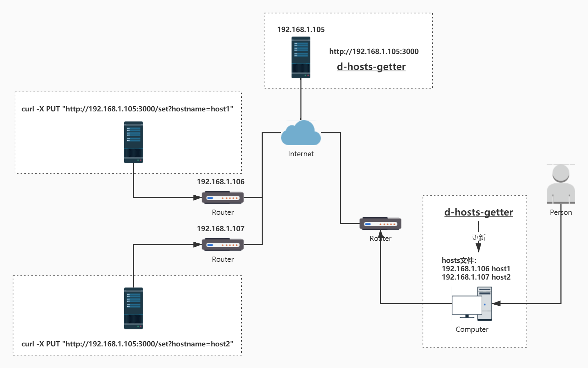

# D-Hosts

当远程主机/路由器 ip 变化时，动态修改本地 hosts 文件，以实现类似 DDNS 的功能。

前提：

- 远程主机/路由器的 ip 为公网 ip
- 拥有一台可以公网访问的（云）服务器

假设：

- 运营商分配给两台路由的 ip 为 `192.168.1.106`，`192.168.1.107`（这里只是示例，运营商分配的公网 ip，不会是 192.*）
- （云）服务器的 ip 为 `192.168.1.105`

安装：

- 在（云）服务器上运行 [d-hosts-getter](https://github.com/zhizuqiu/d-hosts/tree/master/cmd/d-hosts-getter) ，假设程序端口为 `3000`，那么访问地址为 `http://192.168.1.105:3000`
- 分别在两台路由下定时访问 [d-hosts-getter](https://github.com/zhizuqiu/d-hosts/tree/master/cmd/d-hosts-getter) 的 `PUT /set` 接口，例如：`* */1 * * * curl -X PUT "http://192.168.1.105:3000/set?hostname=host1"`
- 在需要更新 hosts 文件的电脑上运行 [d-hosts-setter](https://github.com/zhizuqiu/d-hosts/tree/master/cmd/d-hosts-setter) ，并指定 `http://192.168.1.105:3000` 为获取数据的地址
- 如果路由器的 ip 变化，将会定期更新电脑的 hosts 文件，以实现类似 DDNS 的功能 

## 更新日志
- 2023-05-12 支持 CoreDns ETCD 插件