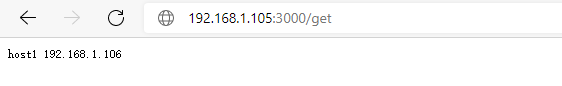

# d-hosts-getter

定时地访问此服务的 `PUT /set` 路径，将路由器ip记录在此服务中，然后通过 `GET /get` 路径获取路由器ip

## build

```bash
GOOS=linux GOARCH=amd64 go build -o dist/amd64/d-hosts-getter
docker buildx build --file=Dockerfile -t zhizuqiu/d-hosts-getter:latest --platform=linux/amd64 . --push
```

## run

```
./d-hosts-getter
```

or docker:

```
docker run -d -p 8007:3000 --restart=always zhizuqiu/d-hosts-getter:latest
```

coredns etcd plugin:

```
docker run -d -p 8007:3000 --restart=always -e ETCDURL=http://localhost:2379 zhizuqiu/d-hosts-getter:latest
```

## use

假设：

- d-hosts-getter 的访问地址为：http://192.168.1.105:3000
- 路由器公网ip：192.168.1.106
- 指定路由器的hostname：host1

在路由器的定时任务中设置：

```
* */1 * * * curl -X PUT "http://192.168.1.105:3000/set?hostname=host1"
# 或指定ip
* */1 * * * curl -X PUT "http://192.168.1.105:3000/set?hostname=host1&ip=192.168.1.106"
```

1.在浏览器中访问 `GET /get` 接口，获取ip：



2.或者使用 [d-hosts-setter](https://github.com/zhizuqiu/d-hosts/tree/master/cmd/d-hosts-setter) 定时更新本地的 hosts 文件，实现自定义域名的访问

3.结合CoreDns ETCD 插件实现 dns 动态更新