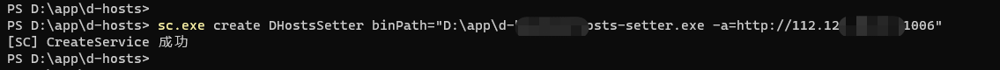
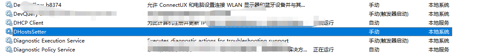
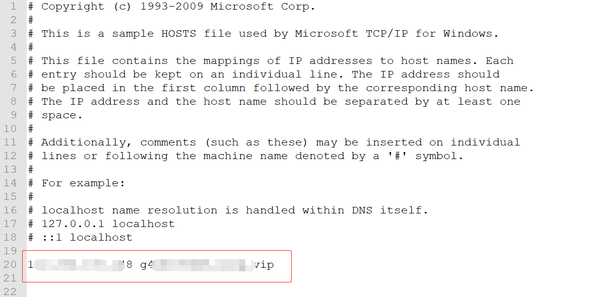
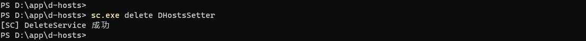

# d-hosts-setter

```
> d-hosts-setter.exe -h
定时更新本地的 hosts 文件，实现自定义域名的访问

用法：
注册到 windows 服务: sc.exe create DHostsSetter binPath="{path-to-this-project}/d-hosts-setter.exe -a={http://d-hosts-getter-host:port}"

-a 指定d-hosts-getter的地址
-i 指定更新间隔，单位：秒

Usage:
  d-hosts-setter [flags]

Flags:
  -a, --address string    d-hosts-getter 的地址
  -h, --help              help for d-hosts-setter
  -i, --interval int      更新间隔，单位：秒 (default 3600)

```

## build

windows:

```bash
go build -o dist/windows/d-hosts-setter.exe
```

linux:

```bash
go build -o dist/linux/d-hosts-setter
GOOS=linux GOARCH=arm64 go build -o dist/linux/arm64/d-hosts-setter
```

## use

首先需要在一个具有公网ip的主机上运行 [d-hosts-getter](https://github.com/zhizuqiu/d-hosts/tree/master/cmd/d-hosts-getter)

### windows:

1.单独运行

```
d-hosts-setter.exe -a={http://d-hosts-getter-host:port}
```

2.或注册到 windows 服务

```
sc.exe create DHostsSetter binPath="{path-to-this-project}/d-hosts-setter.exe -a={http://d-hosts-getter-host:port}"
```



查看已安装的服务，并启动：



默认每个小时更新一下 hosts 文件：



停止、卸载服务：



### mac: 

1.单独运行

```
d-hosts-setter -a={http://d-hosts-getter-host:port}
```

2.或注册到 launchct 服务

编写 .plist 文件

```
sudo vim /Library/LaunchDaemons/cn.zhizuqiu.d-hosts-setter.plist
<?xml version="1.0" encoding="UTF-8"?>
<!DOCTYPE plist PUBLIC "-//Apple//DTD PLIST 1.0//EN" "http://www.apple.com/DTDs/PropertyList-1.0.dtd">
<plist version="1.0">
  <dict>
    <key>KeepAlive</key>
    <dict>
      <key>SuccessfulExit</key>
      <false/>
    </dict>
    <key>Label</key>
    <string>cn.zhizuqiu.d-hosts-setter</string>
    <key>ProgramArguments</key>
    <array>
      <string>/usr/local/opt/d-hosts/d-hosts-setter</string>
      <string>-a={http://d-hosts-getter-host:port}</string>
    </array>
    <key>RunAtLoad</key>
    <true/>
  </dict>
</plist>
```

将程序放入到 `/usr/local/opt/d-hosts/` 目录下

开启服务

```
sudo launchctl load -w /Library/LaunchDaemons/cn.zhizuqiu.d-hosts-setter.plist
```

关闭服务

```
sudo launchctl unload /Library/LaunchDaemons/cn.zhizuqiu.d-hosts-setter.plist
```